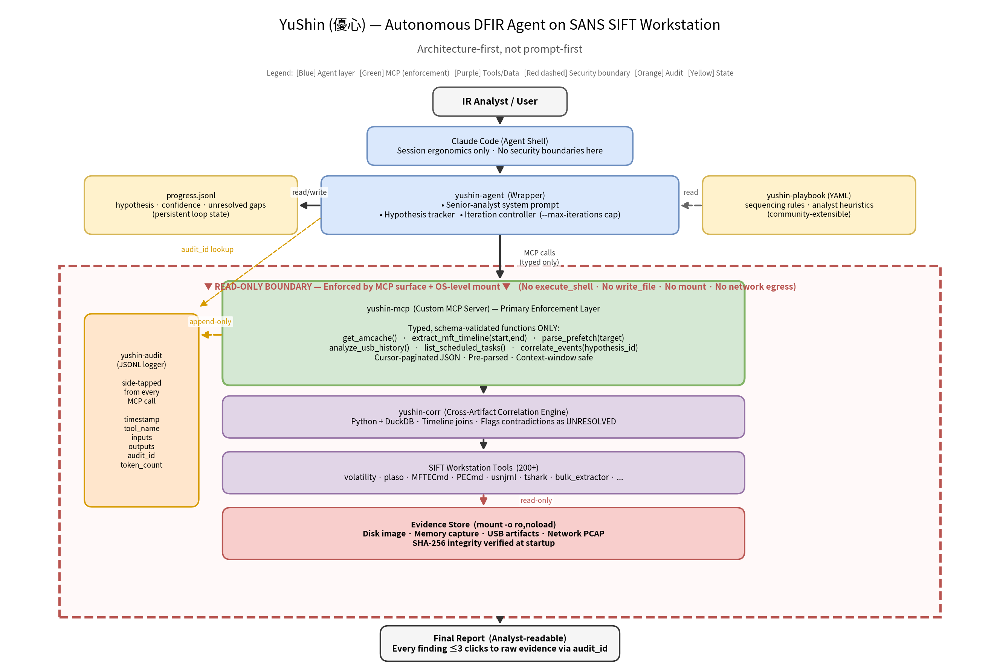

# YuShin (優心) — Autonomous DFIR Agent on SANS SIFT Workstation

> *An autonomous DFIR agent that thinks like a senior analyst.*
> *Architecture-first, not prompt-first.*

**Submission to:** [SANS FIND EVIL! Hackathon 2026](https://findevil.devpost.com/)
**License:** MIT
**Status:** 🚧 Active development — submission deadline June 15, 2026

---

## Why YuShin exists

Protocol SIFT proved that AI agents can operate the SIFT Workstation. It also hallucinates more than a DFIR practitioner can stand behind in a courtroom-grade report. YuShin is an attempt to close that gap by encoding the *reasoning pattern of a senior analyst* as architecture — not as a prompt.

The name is a Japanese reading of **優心**, meaning "discerning mind."

## Architecture



1. **Custom MCP Server** is the primary enforcement layer. The agent has no `execute_shell()`. Destructive commands are not refused — they are *not present*.
2. **Direct Agent Extension on Claude Code** handles session ergonomics. Security boundaries live in the server, not the prompt.
3. **Persistent Learning Loop** forces the agent to write its hypothesis, confidence, and unresolved gaps to disk every iteration. The next iteration must address those gaps or declare them unreachable.

Evidence is mounted **read-only at the OS level** before the agent is ever started. Integrity is a property of the system shape, not a rule the agent is asked to follow.

For the full design rationale, see [`docs/architecture.md`](./docs/architecture.md).

## Repository layout

```text
yushin-dfir/
├── yushin-mcp/        # Custom MCP server: typed, read-only forensic functions
├── yushin-agent/      # Claude Code wrapper: system prompt, hypothesis tracker, iteration controller
├── yushin-corr/       # Cross-artifact correlation engine (Python + DuckDB)
├── yushin-audit/      # Structured JSONL logger — every tool call, every decision
├── yushin-playbook/   # Senior-analyst sequencing rules (YAML, community-extensible)
├── docs/
│   ├── architecture.md
│   ├── dataset.md
│   ├── accuracy-report.md
│   └── troubleshooting.md
├── scripts/
│   └── install.sh     # One-command deploy on a clean SIFT OVA
└── yushin-architecture.png
```

## Quick start (on a SIFT Workstation OVA)

```bash
curl -fsSL https://raw.githubusercontent.com/Juwon1405/yushin-dfir/main/scripts/install.sh | bash
```

Detailed setup and judge-runnable examples: see [`docs/`](./docs).

## Target case class

Insider-threat and DPRK IT-worker-style patterns:

- IP-KVM indicators and anomalous remote-access stacks
- USB timelines contradicting authentication telemetry
- Process-tree anomalies associated with remote-hands operations
- Living-off-the-land sequencing across MFT / Amcache / Prefetch / memory

## Judging-criteria alignment (SANS FIND EVIL!)

| Criterion | How YuShin addresses it |
|---|---|
| Autonomous Execution Quality | Hypothesis-tracker + persistent learning loop |
| IR Accuracy | Cross-artifact correlation; contradictions flagged, not smoothed |
| Breadth / Depth | Disk + memory + USB + network on a single execution trace |
| Constraint Implementation | **Architectural** (no shell passthrough); documented bypass tests |
| Audit Trail Quality | Every finding → `audit_id` → MCP call → command → raw output |
| Usability / Documentation | One-command deploy; YAML playbook extension |

## Roadmap

- macOS evidence depth (UnifiedLogs, KnowledgeC, QuarantineEventsV2, FSEvents)
- Live endpoint triage via MCP-connected Velociraptor / GRR / osquery
- Multi-agent decomposition (Memory / Disk / Network / Synthesizer)
- Accuracy benchmarking framework (community contribution)

## License

MIT — see [LICENSE](./LICENSE).

## Author

**YuShin (優心 / Bang Juwon)** — DFIR practitioner.
Contact via GitHub.
