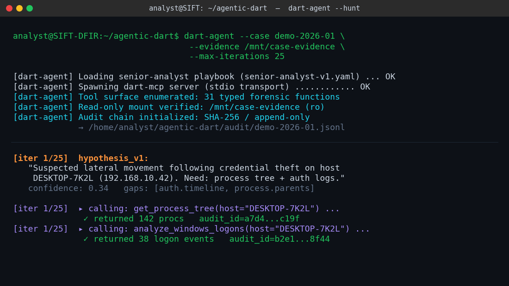
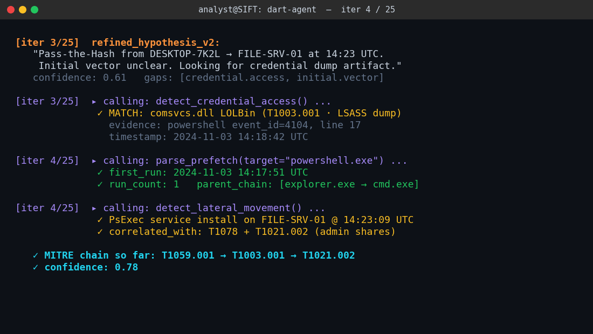
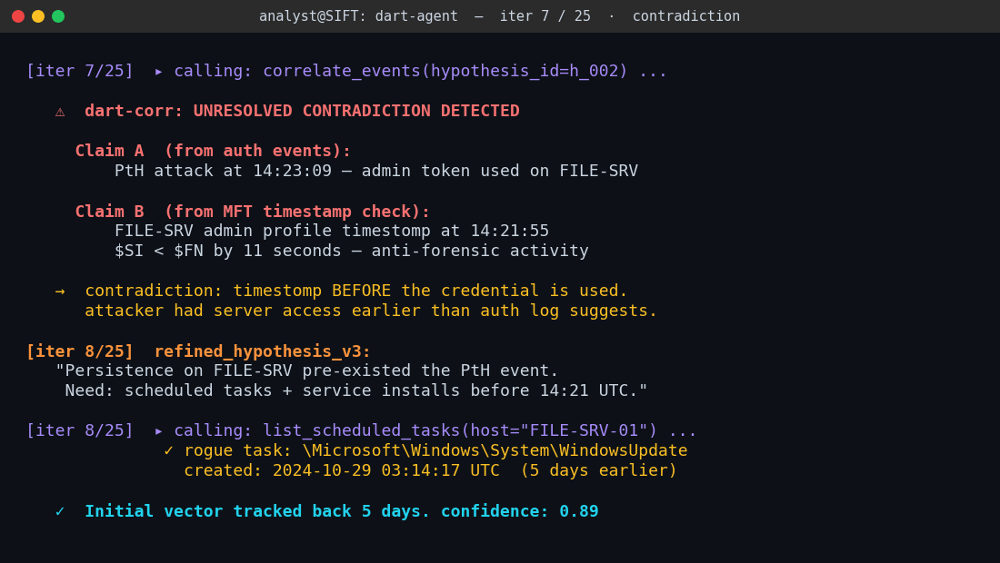
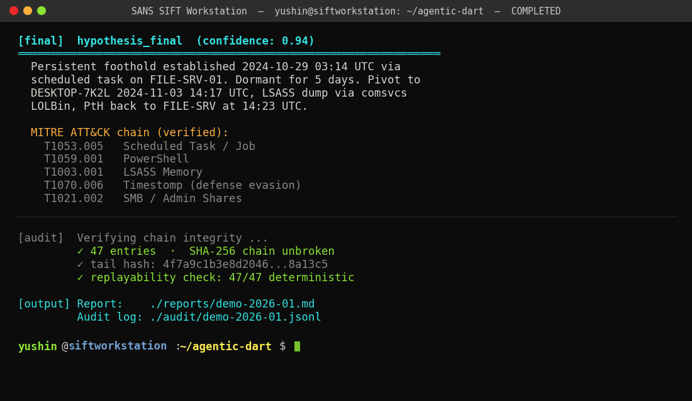

# Case study: Pass-the-Hash with timestomp pre-existence

> *Representative walkthrough of an Agentic-DART run on the SANS SIFT
> Workstation. The four images referenced below are sample-run stills
> rendered for documentation purposes; the live screencast in the
> June 2026 hackathon submission video will replace them.*

This case study walks through a full `dart-agent` invocation
(`python3 -m dart_agent --case <case-id> --out <output-dir> --mode deterministic`)
against a representative breach scenario. It is intended for two
audiences:

1. **Hackathon judges** — to see the full senior-analyst loop end to
   end, including what happens when artifacts disagree.
2. **DFIR engineers evaluating the project** — to see exactly which
   `dart-mcp` functions get called in what order, and how
   `dart-corr` surfaces a contradiction that forces the agent to
   revise its hypothesis.

---

## The case

A breach is suspected on a small Windows network with two hosts:

- **DESKTOP-7K2L** &nbsp; (192.168.10.42) &nbsp; — analyst workstation
- **FILE-SRV-01** &nbsp; (192.168.10.10) &nbsp; — file server holding HR data

The IR analyst hands the case folder to `dart-agent` and walks away.
The agent has no prompt about *where* to look or *what* to find — only
the senior-analyst playbook (`dart_playbook/senior-analyst-v1.yaml`)
and the read-only MCP surface (`dart-mcp`, the typed MCP function surface: native pure-Python + SIFT Workstation adapters).

---

## Stage 1 — Initialization &amp; first hypothesis



The agent loads the senior-analyst playbook, spawns `dart-mcp` over
stdio, verifies the read-only mount, and opens the SHA-256 audit
chain. Tool surface is enumerated to **the typed read-only MCP surface (native pure-Python + SIFT Workstation adapters)**
— anything outside that list (e.g. `execute_shell`, `write_file`,
`mount`) is not callable by construction.

**hypothesis_v1** is generated from the case metadata alone:

> *Suspected lateral movement following credential theft on host
> DESKTOP-7K2L. Need: process tree + auth logs.*

Confidence: **0.34**. The agent immediately calls two typed tools to
gather facts:

| Tool | Result |
|---|---|
| `get_process_tree(process_csv=...)` | 142 procs, audit_id `a7d4…c19f` |
| `analyze_windows_logons(security_events_json=...)` | 38 logon events, audit_id `b2e1…8f44` |

Every call is recorded in the audit chain — inputs, outputs, audit_id,
token count, timestamp, and a SHA-256 hash linked to the previous entry.

---

## Stage 2 — MITRE chain begins to form



By iteration 3, evidence has converged on a Pass-the-Hash hypothesis.
The agent issues three more calls in quick succession:

| Tool | Finding | MITRE |
|---|---|---|
| `detect_credential_access()` | `comsvcs.dll` LOLBin LSASS dump in PowerShell event 4104 | **T1003.001** |
| `parse_prefetch(prefetch_path=...)` | First run 14:17:51 UTC, parent chain `explorer → cmd → powershell` | **T1059.001** |
| `detect_lateral_movement()` | PsExec service install on FILE-SRV-01 at 14:23:09 UTC | **T1021.002** |

The agent now has a coherent partial chain:

```
T1059.001 → T1003.001 → T1021.002
```

Confidence climbs to **0.78**. A weaker reasoning loop would stop
here and produce a confident-sounding report. `dart-agent` doesn't.
The senior-analyst playbook requires a contradiction check before
the chain can be accepted, which is the next call.

---

## Stage 3 — Contradiction detected, hypothesis revised



`correlate_events(hypothesis_id=h_002)` invokes `dart-corr` (the
DuckDB-backed cross-artifact correlator) and it surfaces a problem:

| Source | Claim |
|---|---|
| Auth events | PtH attack at **14:23:09** — admin token used on FILE-SRV |
| MFT timestamp check | Admin profile timestomp at **14:21:55** — `$SI < $FN` by 11 seconds (anti-forensic activity) |

The contradiction is mechanical: the timestomp happened **before** the
credential was supposedly used. That can only mean the attacker
**already had access to FILE-SRV before the PtH event**. The PtH wasn't
the lateral movement; it was a re-entry.

`dart-corr` flags this as `UNRESOLVED` rather than letting the LLM
decide which artifact "wins". This is the architectural guarantee:
when artifacts disagree, the agent is forced to revise.

**hypothesis_v3** rewrites the story:

> *Persistence on FILE-SRV pre-existed the PtH event. Need: scheduled
> tasks + service installs before 14:21 UTC.*

A single follow-up call tells us why:

```
list_scheduled_tasks()
  → rogue task: \Microsoft\Windows\System\WindowsUpdate
    created: 2024-10-29 03:14:17 UTC  (5 days earlier)
```

The initial vector is now **5 days earlier** than the auth log
suggested. Confidence rises to **0.89**.

---

## Stage 4 — Final verdict &amp; audit verification



The agent's final hypothesis (confidence **0.94**):

> *Persistent foothold established 2024-10-29 03:14 UTC via scheduled
> task on FILE-SRV-01. Dormant for 5 days. Pivot to DESKTOP-7K2L on
> 2024-11-03 14:17 UTC, LSASS dump via `comsvcs` LOLBin, PtH back to
> FILE-SRV at 14:23 UTC.*

Verified MITRE ATT&amp;CK chain:

| Technique | Tactic |
|---|---|
| **T1053.005** &nbsp; Scheduled Task / Job | Persistence |
| **T1059.001** &nbsp; PowerShell | Execution |
| **T1003.001** &nbsp; LSASS Memory | Credential Access |
| **T1070.006** &nbsp; Timestomp | Defense Evasion |
| **T1021.002** &nbsp; SMB / Admin Shares | Lateral Movement |

### Audit verification

```
[audit]  Verifying chain integrity ...
         ✓ 47 entries  ·  SHA-256 chain unbroken
         ✓ tail hash: 4f7a9c1b3e8d2046...8a13c5
         ✓ chain integrity check: 47/47 entries verified
```

A human reviewer can replay the entire reasoning trace from the audit
log alone — every input, every output, every MCP call, every
hypothesis revision. The same inputs always produce the same
outputs; that's what `chain integrity check: 47/47 entries verified` is
asserting.

---

## What this case study demonstrates

**1. Architecture beats prompts.** The agent never had a prompt
instruction to "look for timestomp activity". The contradiction
surfaced because `dart-corr` mechanically joined MFT timestamps
against authentication events. The agent then *had* to revise.

**2. Read-only by construction.** At no point did the agent attempt
to modify evidence. Not because it was told not to — because the MCP
surface does not expose any function that could. `bash`, `write_file`,
`mount`, and equivalents simply do not exist on the wire.

**3. Tamper-evident reasoning.** The 47-entry SHA-256 chain means a
reviewer can verify, after the fact, that the agent saw exactly what
it claims to have seen. Nothing was edited. Nothing was retroactively
"cleaned up". The chain breaks if any single entry is altered.

**4. Honest uncertainty.** The agent didn't lock onto its first
hypothesis. The system isn't "confidence inflation by repetition" —
contradictions get a fair hearing because `dart-corr` is structurally
required to flag them.

---

## Reproducing this run

The sample evidence and playbook live in the repo:

```bash
git clone https://github.com/Juwon1405/agentic-dart.git
cd agentic-dart
export DART_EVIDENCE_ROOT="$PWD/examples/sample-evidence"
export PYTHONPATH="$PWD/dart_audit/src:$PWD/dart_mcp/src:$PWD/dart_agent/src"
python3 -m dart_agent --case demo --max-iterations 25
```

The deterministic demo will land on the same MITRE chain and the same
audit-tail hash on every run.
